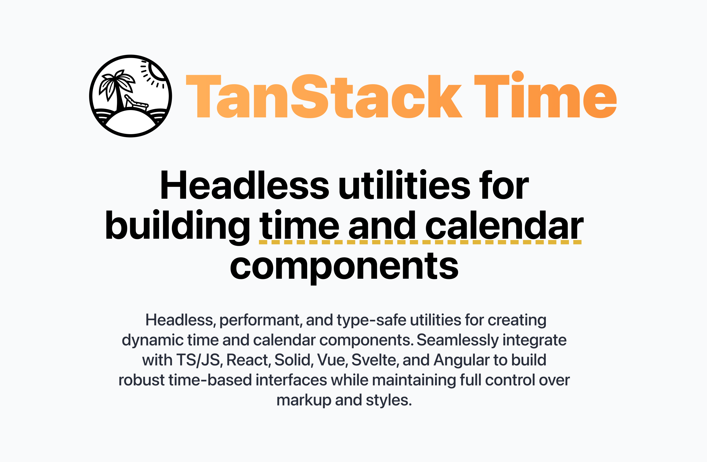

# TanStack Time

🤖⏰ Headless utilities for building time and calendar components in TS/JS, React, Solid, Vue, Svelte and Angular

Enjoy this library? Try the entire [TanStack](https://tanstack.com)!

## Visit [tanstack.com/time](https://tanstack.com/time) for docs, guides, API and more!
